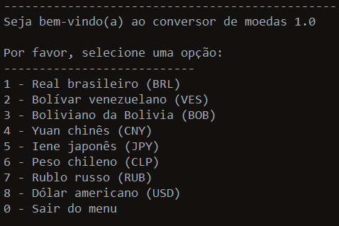
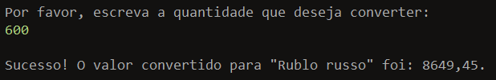

# Conversor de moedas

Uma aplicação que converte moedas a partir de taxas de câmbio recebidas pela api [ExchangeRateAPI](https://app.exchangerate-api.com/).

Este projeto faz parte do Challenge Backend [ONE](https://www.oracle.com/br/education/oracle-next-education/), que é uma formação para gerar profissionais em Backend Java.

## Requisitos
- Conexão com internet;
- Java 21 ou +;
- Uma IDE que suporte Java;

## Como utilizar:
Apenas abra a pasta do projeto na sua IDE favorita e execute o método main na classe Main.java.

## Tecnologias utilizadas
- Java 21
- Intelijj
- Git e GitHub
- Maven
